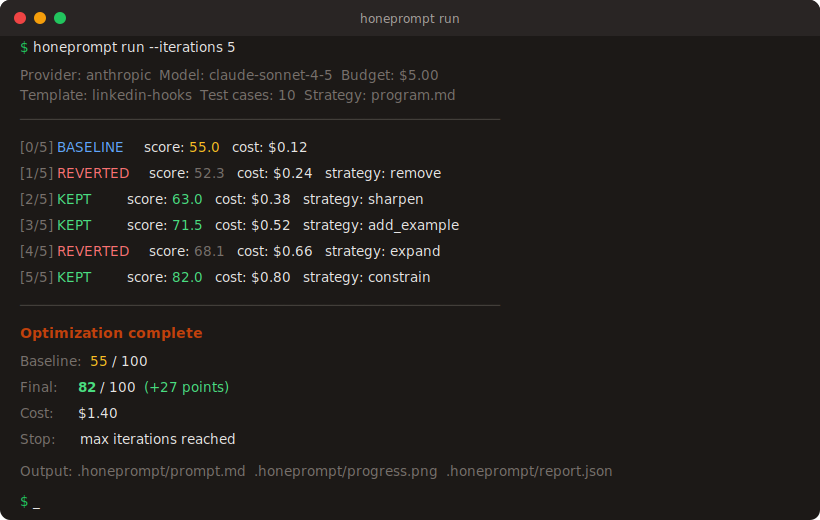

# HonePrompt

**Autonomous prompt optimizer.** Give it a prompt and test cases — it will iteratively mutate, score, and improve your prompt using the Karpathy autoresearch pattern.

[](https://www.npmjs.com/package/honeprompt)
[](LICENSE)
[](https://github.com/jerrysoer/honeprompt)

> **Try the live demo** at [honeprompt.vercel.app](https://honeprompt.vercel.app)

<p align="center">
  
</p>

### Before / After

| | Score |
|---|---|
| **Original prompt** (hand-written) | 55 / 100 |
| **Optimized prompt** (15 iterations, $1.40) | 82 / 100 |

### HonePrompt vs. Alternatives

| Feature | HonePrompt | DSPy | PromptFoo | OpenAI Optimizer |
|---|---|---|---|---|
| Optimizes individual prompts | Yes | No (LLM programs) | No (testing only) | Yes |
| TypeScript-native | Yes | No (Python) | Yes | No (Python) |
| Works with any model | Yes | Yes | Yes | OpenAI only |
| CLI + Web UI | Yes | CLI only | CLI + UI | API only |
| Mutation strategies | 6 strategies | Bootstrapping | N/A | Gradient-free |
| Multi-dimensional rubrics | Yes | No | No | No |
| Multimodal (vision + image-gen) | Yes | No | No | No |
| Resume / continue runs | Yes | No | No | No |
| Real-time progress | SSE streaming | No | No | No |
| Self-hostable | Yes | Yes | Yes | No |

```
honeprompt init linkedin-hooks
honeprompt run
```

## How It Works

```
Load prompt.md + test-cases.json
         |
    +----v----+
    | Baseline |  Execute prompt against all test cases, score with LLM judge
    +----+----+
         |
    +----v--------------------------+
    | Loop (N iterations)           |
    |                               |
    |  1. Failure report            |  Identify lowest-scoring test cases
    |  2. Mutate                    |  Optimizer agent picks a strategy
    |  3. Re-score                  |  Execute mutated prompt, judge outputs
    |  4. Keep or revert            |  Score improved? Keep. Otherwise revert.
    |  5. Log to history.jsonl      |
    |                               |
    +----+--------------------------+
         |
    +----v----+
    | Output  |  Optimized prompt.md + progress.png + report.json
    +---------+
```

## Quick Start

### Install

```bash
npm install -g honeprompt
```

### Create a project

```bash
honeprompt init linkedin-hooks
cd linkedin-hooks
```

This creates:
- `prompt.md` — the prompt to optimize
- `test-cases.json` — test cases with inputs and expected outputs
- `honeprompt.config.ts` — model selection, budget, scoring criteria
- `program.md` — strategy document that shapes optimizer behavior

### Run optimization

```bash
export ANTHROPIC_API_KEY=sk-ant-...
honeprompt run
```

### Score without optimizing

```bash
honeprompt eval
```

## Configuration

```typescript
// honeprompt.config.ts
import type { HonePromptConfig } from "honeprompt";

const config: HonePromptConfig = {
  // Model that executes your prompt
  targetModel: {
    provider: "anthropic",
    model: "claude-sonnet-4-5-20250929",
  },
  // Model that generates mutations
  optimizerModel: {
    provider: "anthropic",
    model: "claude-sonnet-4-5-20250929",
  },
  // Model that judges output quality
  judgeModel: {
    provider: "anthropic",
    model: "claude-sonnet-4-5-20250929",
  },
  maxIterations: 25,
  maxCostUsd: 5.0,
  parallelTestCases: 5,
  scoring: {
    mode: "llm-judge",
    criteria: "Score the output 0-100 on relevance, quality, and completeness.",
  },
  failureReportSize: 3,
  targetScore: 90,
  // Stop if N consecutive mutations are reverted (default: 5)
  plateauThreshold: 5,
};

export default config;
```

### Models

Works with any model via three providers:

| Provider | Models | Notes |
|---|---|---|
| `anthropic` | Claude Sonnet 4.5, Claude Opus 4.6, Claude Haiku 4.5 | API key required |
| `openai` | GPT-4o, GPT-4.1, GPT-4.1-mini, GPT-4.1-nano | API key required |
| `claude-cli` | Any model via Claude Code CLI | Zero-cost if on Claude Max plan |

Use different models for different roles — e.g., cheap model as target, expensive model as judge.

### Scoring Modes

- **`llm-judge`** — LLM scores each output against your criteria (default)
- **`programmatic`** — Your custom eval function scores outputs
- **`hybrid`** — Weighted combination of both

For programmatic scoring, export a function:

```typescript
// eval.ts
import type { TestCase } from "honeprompt";

export default function score(output: string, testCase: TestCase): number {
  // Return 0-100
  if (output.length > 200) return 30; // too long
  if (!output.includes(testCase.input.split(" ")[0])) return 50; // missed topic
  return 85;
};
```

Then set `scoring.evalPath: "./eval.ts"` in your config.

### Multi-Dimensional Rubrics

Replace the single 0-100 score with weighted dimensions:

```typescript
scoring: {
  mode: "llm-judge",
  dimensions: [
    { name: "accuracy", weight: 0.4, criteria: "Factual correctness" },
    { name: "tone", weight: 0.3, criteria: "Professional yet approachable" },
    { name: "format", weight: 0.3, criteria: "Clean markdown, scannable structure" },
  ],
},
```

Each dimension is scored independently by the judge, then combined into a weighted composite score. The optimizer sees per-dimension breakdowns in failure reports, so it can target specific weaknesses.

## Mutation Strategies

The optimizer uses Claude tool use to apply structured mutations:

| Strategy | When Used |
|---|---|
| `sharpen` | Tighten vague instructions |
| `add_example` | Model misunderstands format/tone |
| `remove` | Contradictory or redundant rules |
| `restructure` | Information is buried or poorly ordered |
| `constrain` | Output goes off-track |
| `expand` | Instructions are under-specified |

One mutation per iteration. The optimizer learns from history — if a strategy was reverted, it tries a different approach.

### Strategy Documents

Add a `program.md` file to guide the optimizer with domain knowledge, constraints, or preferred mutation patterns. The strategy document is prepended to the optimizer system prompt.

```bash
honeprompt run --strategy program.md
```

If `program.md` exists in your project directory, it is auto-detected.

## Multimodal

### Vision test cases

Include images in your test cases for vision-capable models:

```json
{
  "id": "chart-analysis",
  "input": "Describe what this chart shows",
  "images": ["https://example.com/chart.png"]
}
```

### Image generation optimization

Set `mode: "image-gen"` to optimize prompts for image generation models (DALL-E). The judge uses vision to score generated images against your criteria.

## Smart Stopping

HonePrompt stops automatically when:

- **Target score reached** — score hits your `targetScore` threshold
- **Budget exhausted** — total cost exceeds `maxCostUsd`
- **Plateau detected** — N consecutive mutations reverted (configurable via `plateauThreshold`)
- **Cancelled** — manual stop via CLI (Ctrl+C) or web UI

## Resume Runs

Stopped or cancelled runs can be resumed. The JSONL history file is append-only and crash-safe.

```bash
# CLI: resumes from the last saved state
honeprompt run --resume
```

In the web UI, completed/cancelled/plateau runs show a "Continue Run" button.

## Templates

Start with a ready-made template instead of building from scratch:

```bash
honeprompt init --list           # Browse all templates
honeprompt init linkedin-hooks   # Scaffold from a template
```

| Template | Category | Description |
|----------|----------|-------------|
| `linkedin-hooks` | Creators | Scroll-stopping LinkedIn post hooks |
| `tiktok-hooks` | Creators | Spoken-word TikTok video hooks |
| `youtube-titles` | Creators | Click-worthy YouTube titles under 60 chars |
| `claude-md-optimizer` | Developers | Actionable CLAUDE.md files for AI assistants |
| `code-review-comments` | Developers | Constructive, specific code review comments |
| `commit-messages` | Developers | Conventional commit messages from diffs |
| `product-descriptions` | Marketers | Benefit-driven product copy |
| `seo-meta-descriptions` | Marketers | SEO meta descriptions under 160 chars |
| `cold-outreach-email` | SaaS | Personalized cold emails under 100 words |
| `customer-support-replies` | SaaS | Empathetic support replies with clear resolutions |

Browse templates in the web UI at [honeprompt.vercel.app/templates](https://honeprompt.vercel.app/templates).

### Community Templates

Want to contribute a template? See [CONTRIBUTING.md](CONTRIBUTING.md) for guidelines. Copy `templates/_template/` to get started.

## CLI Reference

```bash
honeprompt init [template]       # Scaffold a project
honeprompt init --list           # List all available templates
honeprompt run [options]         # Run optimization loop
honeprompt eval [options]        # Score current prompt (no optimization)
honeprompt generate-tests [opt]  # Generate test cases from a prompt using AI
honeprompt diff [options]        # Show diff between original and optimized prompt
honeprompt estimate [options]    # Estimate cost for an optimization run

# Run options
  -p, --prompt <path>      # Prompt file (default: prompt.md)
  -t, --tests <path>       # Test cases file (default: test-cases.json)
  -c, --config <path>      # Config file (default: honeprompt.config.ts)
  -o, --output <path>      # Output directory (default: .honeprompt)
  -n, --iterations <n>     # Override max iterations
  --budget <usd>           # Override max cost
  --strategy <path>        # Strategy document (default: auto-detect program.md)
  --resume                 # Resume a previous run
```

## Programmatic API

```typescript
import { run, scorePrompt, generateMutation } from "honeprompt";

// Run the full optimization loop
const report = await run({
  promptPath: "./prompt.md",
  testCasesPath: "./test-cases.json",
  config: { /* ... */ },
  outputDir: "./.honeprompt",
});

console.log(`Improved ${report.baselineScore} -> ${report.finalScore}`);
console.log(`Stop reason: ${report.stopReason}`);
```

## Output Files

After a run, `.honeprompt/` contains:

- `history.jsonl` — every iteration as a JSON line (append-only, crash-safe)
- `progress.png` — score chart with baseline, improvements, and reverts
- `report.json` — full run summary with strategy stats

### Badge

Add this badge to your project README to show your prompts were optimized with HonePrompt:

```markdown
[](https://github.com/jerrysoer/honeprompt)
```

## Cost

Typical costs for a 25-iteration run with 10 test cases:

| Configuration | Estimated Cost |
|---|---|
| Sonnet for all three roles | $1-3 |
| Haiku target, Sonnet optimizer/judge | $0.50-1.50 |
| Sonnet target, Opus optimizer, Sonnet judge | $3-8 |
| Claude CLI (Max plan) for all roles | $0 |

Set `maxCostUsd` in config to cap spending. The loop stops when the budget is reached.

Use `honeprompt estimate` to preview costs before starting a run.

## FAQ

**How is this different from DSPy?**
DSPy optimizes LLM programs (chains of calls). HonePrompt optimizes individual prompts — simpler scope, TypeScript-native, works with any model.

**How is this different from PromptFoo?**
PromptFoo tests prompts. HonePrompt optimizes them. They are complementary — use PromptFoo to evaluate, HonePrompt to improve.

**Does it work with local models?**
Yes — set `baseUrl` in your model config to point to any OpenAI-compatible API (Ollama, vLLM, etc.).

**Can I use it without an API key?**
Yes — use the `claude-cli` provider with a Claude Max subscription for zero-cost optimization runs.

**Can I resume a failed run?**
Yes — use `honeprompt run --resume` in the CLI or the "Continue Run" button in the web UI. State is reconstructed from the crash-safe JSONL history file.

## License

MIT
